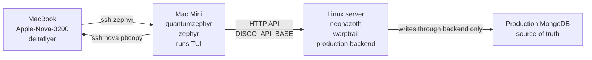
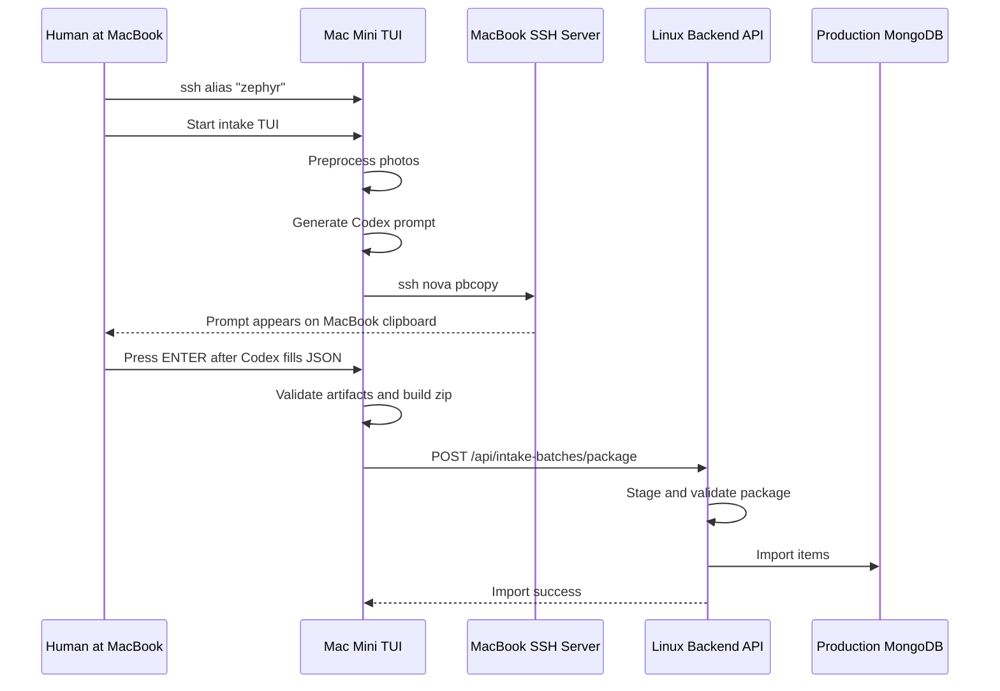

# The SSH Handshake Field Guide

_A story about a MacBook, a Mac Mini, a Linux server, a clipboard, and the long road to one working inventory import._

## Why This Exists

This guide grew out of one deceptively simple goal:

> Run the DiscoWarpCore photo intake TUI from the Mac Mini, control it from the MacBook, send import batches to the Linux production server, and copy the generated Codex prompt back to the MacBook clipboard automatically.

That sentence sounds small. It is not small.

It contains three machines, three user accounts, two directions of SSH trust, one production API, a Node TUI, an image preprocessing tool, a backend package importer, and the macOS clipboard. Each part worked by itself at least once. Several parts failed only when they were combined. That is normal systems work: the individual pieces are often innocent, and the crime happens at the border between them.

This document tells the story in plain language for someone who is just beginning to understand SSH and wants to think like an IT technician. It is not only a list of commands. It explains what the commands meant, why the errors mattered, and how to reason through the next failure without panic.

## The Cast

The setup had three important machines:

**MacBook**

- Human-facing laptop.
- Hostname: `Apple-Nova-3200`
- User: `deltaflyer`
- SSH alias used from the Mac Mini: `nova`
- This is where the clipboard needed to end up.

**Mac Mini**

- Always-ish available local workstation used to run the TUI code.
- Hostname: `quantumzephyr`
- User: `zephyr`
- SSH alias used from the MacBook: `zephyr`
- Repo path: `/Volumes/Luna/Developer-Luna/discowarpcore`
- Intake folder: `/Users/zephyr/Intake`
- This is where the TUI actually runs.

**Linux production server**

- Household inventory production host.
- Hostname used in the thread: `neonazoth`
- User: `warptrail`
- LAN IP: `192.168.1.37`
- Backend API port: `5002`
- Production MongoDB lives here and is the source of truth.

The most important mental model is this:



The MacBook is the hands and eyes. The Mac Mini is the tool bench. The Linux server is the production system. The database is not touched directly by the TUI.

## The Final Working Shape

From the MacBook, connect to the Mac Mini using the local alias:

```bash
zephyr
```

Inside the Mac Mini shell, wake up an SSH agent and load the key:

```bash
eval "$(ssh-agent -s)"
ssh-add ~/.ssh/quantumazoth_ed25519
```

Confirm the Mac Mini can SSH back to the MacBook without prompting:

```bash
ssh -o BatchMode=yes nova true
```

Confirm the Mac Mini can copy text into the MacBook clipboard:

```bash
printf 'clipboard test from quantumzephyr' | ssh -o BatchMode=yes nova pbcopy
```

Paste on the MacBook. If the text appears, the clipboard bridge is working.

Then launch the intake TUI from the same Mac Mini shell session:

```bash
cd /Volumes/Luna/Developer-Luna/discowarpcore

DISCO_ENV=production \
DISCO_API_BASE=http://192.168.1.37:5002 \
DISCO_PROMPT_CLIPBOARD_SSH_TARGET=nova \
npm run intake:tui
```

The phrase "same shell session" matters because `ssh-agent` state is stored in environment variables. If you open a fresh terminal later, that terminal may not know which agent to use.

## What We Were Actually Building

The photo intake workflow is a staged pipeline:

1. Drop photos into the intake inbox on the Mac Mini.
2. Start a batch in the TUI.
3. The TUI preprocesses images using ObjectGlow.
4. The TUI creates JSON stubs.
5. Codex fills in the JSON item descriptions.
6. The TUI validates the image/JSON artifacts.
7. The TUI builds a zip package.
8. The TUI uploads the package to the production backend API.
9. The backend stages, validates, and imports the batch into production MongoDB.

The hard rule was:

> The TUI must not write directly to MongoDB.

That means the TUI talks to the backend API. The production backend writes to production MongoDB. This keeps one clear source of truth and prevents the classic disaster where a workstation copy of data quietly diverges from the server.

## First Confusion: Where Is the TUI Running?

At one point the question was:

> "The TUI will run on my laptop but the code is being executed on the Mac Mini which calls an API on the Linux server?"

That is a very common SSH brain-bender.

If you sit at your MacBook and type:

```bash
zephyr
```

you are still physically using the MacBook keyboard and screen. But the shell prompt after login belongs to the Mac Mini:

```text
zephyr@quantumzephyr ~ %
```

Any command you type there runs on the Mac Mini, not the MacBook. So this command:

```bash
npm run intake:tui
```

starts Node on the Mac Mini. If that Node process calls `pbcopy`, it copies to the Mac Mini clipboard. If it reads `/Users/zephyr/Intake`, it reads the Mac Mini filesystem. If it runs ObjectGlow, it needs ObjectGlow installed on the Mac Mini.

The MacBook is only acting as a remote control unless we deliberately build a bridge back to it.

## SSH Aliases Are Local Nicknames

One moment in the thread looked like this:

```bash
ssh quantumzephyr
```

and it failed because the MacBook did not know a host named `quantumzephyr`.

Then this worked:

```bash
zephyr
```

That means `zephyr` was probably a shell alias or SSH alias on the MacBook. The important lesson is that aliases are local. An alias that exists on the MacBook does not automatically exist on the Mac Mini, and an alias that exists on the Mac Mini does not automatically exist on the Linux server.

A typical MacBook-side SSH config might contain something like:

```sshconfig
Host zephyr
  HostName quantumzephyr.local
  User zephyr
```

or it might point to a fixed LAN IP instead of a `.local` name.

The Mac Mini had its own alias pointing back to the MacBook:

```sshconfig
Host nova
  HostName Apple-Nova-3200.local
  User deltaflyer
  IdentityFile ~/.ssh/quantumazoth_ed25519
  IdentitiesOnly yes
```

Those aliases live in different files on different machines. They are conveniences, not universal names.

One more subtle point: the key file was named:

```text
quantumazoth_ed25519
```

That filename is just a label. It does not force the key to be used only for a machine named `quantumazoth`. SSH cares about the key's cryptographic contents, not the story in the filename. A confusing filename can still contain a perfectly valid key.

## The First Port-Forwarding Detour

We discussed:

```bash
ssh -L 5002:localhost:5002 warptrail@quantumazoth.local
```

This is an SSH local port forward.

The `-L` means:

> Listen on a port on my local machine, and forward traffic through SSH to a host and port visible from the remote machine.

The shape is:

```bash
ssh -L LOCAL_PORT:DESTINATION_HOST:DESTINATION_PORT user@ssh-server
```

So:

```bash
ssh -L 5002:localhost:5002 user@server
```

means:

> Open port `5002` on this machine. Anything sent there should travel through SSH to `server`, then from the server connect to `localhost:5002`.

Why port `5002`? Because DiscoWarpCore's backend API listens on port `5002`.

Why did it look like it was "hanging"? Because plain SSH opens a remote login session and waits. That is normal. A tunnel command often looks idle because it is doing its job: holding the tunnel open.

In the end, port forwarding was not the main solution because the Mac Mini could call the production API directly over LAN:

```bash
DISCO_API_BASE=http://192.168.1.37:5002
```

But learning `-L` was still useful. It is the tool you use when a service should stay private to a server, but you want to reach it temporarily through SSH.

## The Name Problem: Hostnames Are Not Magic

Early on, this failed:

```bash
ping -c 3 quantumazoth.local
```

with:

```text
cannot resolve quantumazoth.local: Unknown host
```

That was not an SSH authentication problem. It was a naming problem. The Mac Mini could not turn `quantumazoth.local` into an IP address.

A hostname is just a name. Something must resolve that name:

- DNS
- mDNS / Bonjour for `.local` names
- `/etc/hosts`
- an SSH config alias

When this failed:

```bash
ssh warptrail@quantumazoth.local
```

the problem happened before password or key authentication. SSH could not even find the host.

Later we learned the production server was actually reachable as:

```bash
ssh neonazoth
```

and its LAN IP was:

```text
192.168.1.37
```

That is why the API target became:

```bash
DISCO_API_BASE=http://192.168.1.37:5002
```

An IT technician habit worth building:

1. Can I resolve the name?
2. Can I reach the IP?
3. Is the port open?
4. Does the service answer?
5. Only then debug credentials or application code.

## The Health Check That Refused to Help

This failed:

```bash
curl -v --max-time 5 http://127.0.0.1:5002/api/health
```

with:

```text
connect to 127.0.0.1 port 5002 failed: Connection refused
```

That means:

> I reached the machine named `127.0.0.1`, but nothing was listening on port `5002`.

The tricky part is that `127.0.0.1` means "this machine." It does not mean "the server I am thinking about." If you run it on the MacBook, it means the MacBook. If you run it on the Mac Mini, it means the Mac Mini. If you run it on the Linux server, it means the Linux server.

So this:

```bash
curl http://127.0.0.1:5002/api/health
```

only checks the backend if the backend is running on the same machine where the command is executed.

For the Mac Mini talking to production, the meaningful health check was:

```bash
curl http://192.168.1.37:5002/api/health
```

When the server was running, it returned:

```json
{"ok":true}
```

## The SSH Key Story

SSH key authentication has two halves:

- A private key, kept on the client machine.
- A public key, installed on the server in `authorized_keys`.

The private key proves identity. The public key tells the server which private keys it should trust.

In this setup, the Mac Mini needed to SSH into the MacBook so it could run:

```bash
pbcopy
```

on the MacBook.

The trust direction was:

```text
Mac Mini private key -> MacBook authorized_keys
```

The command used to install the Mac Mini public key onto the MacBook was:

```bash
ssh-copy-id -i ~/.ssh/quantumazoth_ed25519.pub deltaflyer@Apple-Nova-3200.local
```

This copied the public key into the MacBook account's SSH authorization list. It did not copy the private key. That distinction matters. Never casually copy private keys around.

After that, an interactive test worked:

```bash
ssh nova
```

But then the noninteractive test failed:

```bash
ssh -o BatchMode=yes nova true
```

with:

```text
Permission denied (publickey,password,keyboard-interactive).
```

This felt contradictory. It was not.

Interactive SSH was allowed to ask for a password or key passphrase. `BatchMode=yes` says:

> Do not ask me questions. Either key authentication works silently, or fail.

The TUI needed noninteractive behavior. It cannot stop in the middle of a prompt copy and ask for a password. So `BatchMode=yes` was the honest test.

## The Key Was Trusted, But Still Could Not Sign

The verbose SSH log included an important line:

```text
Server accepts key: /Users/zephyr/.ssh/quantumazoth_ed25519
```

This means the MacBook recognized the public key. The server side was set up correctly.

But the login still failed. The private key was encrypted with a passphrase, and the Mac Mini shell had no active `ssh-agent` holding the unlocked key.

That is why this failed:

```bash
ssh-add --apple-use-keychain ~/.ssh/quantumazoth_ed25519
```

with:

```text
Could not open a connection to your authentication agent.
```

There was no agent to talk to.

The fix was:

```bash
eval "$(ssh-agent -s)"
ssh-add ~/.ssh/quantumazoth_ed25519
```

The first command starts an agent and exports environment variables like `SSH_AUTH_SOCK`. The second command adds the private key to that agent. After that, SSH can use the key without asking for the passphrase again in that shell session.

This is one of the core SSH lessons:

> Installing a public key proves the server is willing to trust you. Loading the private key into an agent proves your client can actually use that trust noninteractively.

## The Clipboard Problem

The TUI generated a file named:

```text
CODEX_AGENT_PROMPT.md
```

The goal was to copy that prompt into the MacBook clipboard.

At first, the TUI used `pbcopy`. But remember where the TUI runs:

```text
MacBook terminal -> SSH into Mac Mini -> TUI runs on Mac Mini
```

So `pbcopy` runs on the Mac Mini. It does not copy to the MacBook clipboard.

We tried an SSH terminal clipboard escape called OSC 52. In simple terms, OSC 52 is a special sequence of characters that a remote shell can print. Some terminal apps interpret it as "put this text on the local clipboard."

That can be elegant. It can also be unreliable. A terminal may ignore OSC 52 for security reasons, configuration reasons, or because it only partially supports it.

So we moved to a more explicit bridge:

```bash
ssh -o BatchMode=yes nova pbcopy
```

The TUI pipes the prompt text into that command. The command runs `pbcopy` on the MacBook. That means the clipboard write happens on the machine whose clipboard we actually care about.

The test command was:

```bash
printf 'clipboard test from quantumzephyr' | ssh -o BatchMode=yes nova pbcopy
```

If that text can be pasted on the MacBook, then the TUI prompt copy can work too.

## Why `scp` Was Close But Not Quite the Same

We also discussed using `scp`.

`scp` copies files over SSH. It is useful if the goal is:

> Put `CODEX_AGENT_PROMPT.md` on the MacBook Desktop.

But the actual goal became:

> Put the contents of `CODEX_AGENT_PROMPT.md` into the MacBook clipboard.

For that, this shape is better:

```bash
ssh nova pbcopy < CODEX_AGENT_PROMPT.md
```

or, inside Node, piping the prompt text into:

```bash
ssh -o BatchMode=yes nova pbcopy
```

`scp` moves files. `ssh ... pbcopy` performs a remote action.

That distinction is useful everywhere:

- Use `scp` when you want to copy bytes into a file path.
- Use `ssh command` when you want to make the remote machine do something.

## The API Targeting Problem

The TUI originally had development assumptions: localhost, local ports, and workstation paths.

For production intake, the target needed to be explicit:

```bash
DISCO_API_BASE=http://192.168.1.37:5002
```

The TUI now prints the API target and checks:

```bash
GET /api/health
```

before import work.

In development, localhost can be fine:

```bash
DISCO_API_BASE=http://localhost:5002
```

In production mode, the TUI should not guess:

```bash
DISCO_ENV=production
```

means:

> Require an explicit production API target.

This prevents a dangerous situation where an operator thinks they are importing into production but the TUI is quietly talking to a development backend.

## The ObjectGlow Path Problem

The image preprocessor failed with:

```text
spawn /Users/zephyr/Developer/objectiglow/.venv/bin/python ENOENT
```

`ENOENT` means:

> No such file or directory.

The TUI was trying to run ObjectGlow from an old path:

```text
/Users/zephyr/Developer/objectiglow
```

But the current checkout was:

```text
/Volumes/Luna/Developer-Luna/objectiglow
```

This was not an SSH problem. It was a filesystem assumption problem.

The lesson:

> Once a tool runs on a different machine, every absolute path must be true on that machine.

The MacBook's paths do not matter to a process running on the Mac Mini. The Mac Mini's paths do not matter to a process running on the Linux server.

## The `zipinfo` Problem

After the TUI uploaded a package to production, the backend failed with:

```text
spawn /usr/bin/zipinfo ENOENT
```

Again, `ENOENT` means the executable was missing. The Linux server did not have `/usr/bin/zipinfo`.

The backend was patched to try multiple archive tools:

- `zipinfo`
- `unzip -Z1`
- `bsdtar -tf`

The production server had `bsdtar`, so the backend could inspect and unpack zip files without requiring `zipinfo`.

The lesson:

> Production servers often have a smaller toolset than development machines. Code that shells out should either declare its dependencies clearly or support reasonable fallbacks.

## The `EXDEV` Problem

Then the backend failed with:

```text
EXDEV: cross-device link not permitted, rename '/tmp/...' -> '/home/warptrail/Intake/...'
```

This was not an SSH problem either. It was a filesystem boundary problem.

The backend unpacked the zip into `/tmp`, then tried to move files into:

```text
/home/warptrail/Intake/discowarpcore/...
```

On Linux, `rename()` is fast and atomic when source and destination are on the same filesystem. But if `/tmp` and `/home` are on different filesystems, `rename()` cannot cross that boundary.

The fix was:

1. Try `rename()`.
2. If the OS returns `EXDEV`, use `copyFile()`.
3. Remove the original temp file.

In plain language:

> If you cannot slide the file across the floor, make a copy in the new room and clean up the old one.

## The Failed Batch Retry Problem

After the backend was fixed, retrying the failed TUI batch exposed one more issue:

```text
ENOENT: no such file or directory, open '/Users/zephyr/Intake/processing/.../package/...zip'
```

The batch had moved from:

```text
/Users/zephyr/Intake/processing/...
```

to:

```text
/Users/zephyr/Intake/failed/...
```

But its saved package path still pointed back to the old `processing` folder.

The TUI was patched so a failed batch clears stale package paths when it moves. The direct import flow also checks whether the saved zip actually exists. If it does not, the TUI rebuilds the package from the current batch folder.

The lesson:

> Cached paths are not facts. Before reusing a saved path, check that the file still exists.

## The Commands We Tried, and What They Taught Us

### `ssh host`

```bash
ssh nova
```

Opens an interactive SSH session. If it appears to sit there after login, that is not hanging. It is waiting for commands.

### `ssh host command`

```bash
ssh nova true
```

Runs one command on the remote machine and exits. `true` does nothing and returns success. It is a clean connectivity test.

### `ssh -o BatchMode=yes host true`

```bash
ssh -o BatchMode=yes nova true
```

Tests whether SSH can succeed without asking for passwords or passphrases. This is the right test for scripts and TUI automation.

### `ssh -vvv ...`

```bash
ssh -vvv -i ~/.ssh/quantumazoth_ed25519 -o IdentitiesOnly=yes -o BatchMode=yes deltaflyer@Apple-Nova-3200.local true
```

Turns on verbose debugging. It is noisy, but it tells you whether SSH offered a key, whether the server accepted the key, and why authentication continued or stopped.

### `ssh-copy-id`

```bash
ssh-copy-id -i ~/.ssh/quantumazoth_ed25519.pub deltaflyer@Apple-Nova-3200.local
```

Installs a public key on a remote account. It makes the server willing to trust the matching private key.

### `ssh-agent`

```bash
eval "$(ssh-agent -s)"
ssh-add ~/.ssh/quantumazoth_ed25519
```

Starts an agent and loads an encrypted private key into it. This lets later SSH commands use the key without prompting again.

### Clipboard over SSH

```bash
printf 'clipboard test from quantumzephyr' | ssh -o BatchMode=yes nova pbcopy
```

Runs `pbcopy` on the MacBook and pipes text into it from the Mac Mini.

### Health check

```bash
curl http://192.168.1.37:5002/api/health
```

Asks the production backend whether it is alive.

### TUI launch

```bash
DISCO_ENV=production \
DISCO_API_BASE=http://192.168.1.37:5002 \
DISCO_PROMPT_CLIPBOARD_SSH_TARGET=nova \
npm run intake:tui
```

Starts the production-targeted intake TUI with MacBook clipboard bridging.

## A Technician's Debugging Ladder

When SSH or local-network automation fails, climb this ladder from the bottom. Do not start at the top.

1. **Am I on the machine I think I am on?**

   Check the prompt:

   ```bash
   hostname
   whoami
   pwd
   ```

2. **Can the name resolve?**

   ```bash
   ping host.local
   ```

   Or skip the name and test the IP directly.

3. **Can I reach the port?**

   ```bash
   nc -vz host 22
   nc -vz 192.168.1.37 5002
   ```

4. **Can SSH login interactively?**

   ```bash
   ssh nova
   ```

5. **Can SSH login noninteractively?**

   ```bash
   ssh -o BatchMode=yes nova true
   ```

6. **If noninteractive fails, is the key installed?**

   Use:

   ```bash
   ssh -vvv ...
   ```

   Look for:

   ```text
   Offering public key
   Server accepts key
   ```

7. **If the server accepts the key, can the client sign with it?**

   Start an agent:

   ```bash
   eval "$(ssh-agent -s)"
   ssh-add ~/.ssh/keyname
   ```

8. **Can the actual remote action work?**

   For this project:

   ```bash
   printf 'test' | ssh -o BatchMode=yes nova pbcopy
   ```

9. **Can the production API answer?**

   ```bash
   curl http://192.168.1.37:5002/api/health
   ```

10. **Can the app workflow complete?**

    Only after the lower layers are healthy should you retry the TUI import.

## Glossary

**API**

An application interface over HTTP. In this project, the TUI uploads packages to the DiscoWarpCore backend API instead of writing directly to MongoDB.

**Authorized keys**

A file on an SSH server account, usually `~/.ssh/authorized_keys`, listing public keys allowed to log in as that user.

**BatchMode**

An SSH option that disables interactive password and passphrase prompts. Use it to test whether automation will work.

**Client**

The machine initiating an SSH connection. If the Mac Mini runs `ssh nova`, the Mac Mini is the SSH client.

**DISCO_API_BASE**

The environment variable telling the TUI which backend API to call. For production in this setup:

```bash
DISCO_API_BASE=http://192.168.1.37:5002
```

**DISCO_ENV**

The environment variable declaring the runtime mode. In production:

```bash
DISCO_ENV=production
```

**DISCO_PROMPT_CLIPBOARD_SSH_TARGET**

The environment variable telling the TUI where to send the generated Codex prompt for clipboard copy. In this setup:

```bash
DISCO_PROMPT_CLIPBOARD_SSH_TARGET=nova
```

**DNS**

The system that turns hostnames into IP addresses. `.local` names often use mDNS / Bonjour rather than traditional DNS.

**ENOENT**

"Error, no entry." Usually means a file, directory, or executable does not exist at the path being used.

**EXDEV**

A filesystem error meaning a rename tried to cross device boundaries. Use copy-and-delete fallback.

**Host alias**

A short SSH name defined in `~/.ssh/config`. For example, `nova` can stand for `deltaflyer@Apple-Nova-3200.local` with a specific identity file.

**IdentityFile**

The private key path SSH should use for a host.

**Localhost**

The current machine, usually `127.0.0.1`. It changes meaning depending on where the command runs.

**mDNS / Bonjour**

The local network naming system often responsible for `.local` hostnames on Macs.

**MongoDB**

The database used by DiscoWarpCore. Production MongoDB lives on the Linux server and is the source of truth.

**OSC 52**

A terminal escape sequence that can ask a terminal to copy text to the local clipboard. Useful when supported, unreliable when blocked or ignored.

**pbcopy**

macOS command-line tool that reads standard input and puts it on the clipboard.

**Port forwarding**

SSH feature that forwards a local port through an SSH connection to a host/port reachable from the remote side.

**Private key**

The secret SSH key kept on the client. Do not casually copy it between machines.

**Public key**

The shareable SSH key installed into a server's `authorized_keys`.

**scp**

Secure copy over SSH. Good for moving files, not for running remote clipboard commands.

**Server**

The machine accepting an SSH connection. If the Mac Mini runs `ssh nova`, the MacBook is the SSH server.

**ssh-agent**

A background process that holds unlocked private keys so SSH commands can authenticate without prompting every time.

**TUI**

Text user interface. Here, the Node-based DiscoWarpCore photo intake tool.

## The Final Mental Model

The working system is not "the MacBook runs everything." It is:

1. The MacBook opens an SSH session into the Mac Mini.
2. The Mac Mini runs the TUI.
3. The Mac Mini preprocesses photos and builds the intake package.
4. The Mac Mini sends HTTP requests to the production backend on the Linux server.
5. The Linux backend validates and imports through its own server-side code.
6. The Linux backend writes to production MongoDB.
7. When the TUI creates a prompt, the Mac Mini SSHes back into the MacBook and runs `pbcopy`.

Once you see the direction of each arrow, the whole setup becomes less mysterious.



## What To Remember Next Time

When something fails, name the layer before fixing it.

If a hostname cannot resolve, do not debug keys.

If a port refuses connections, do not debug JSON.

If `BatchMode=yes` fails but interactive SSH works, suspect prompts, passphrases, or `ssh-agent`.

If `pbcopy` works on the wrong machine, remember where the process is actually running.

If an import reaches production and fails with `ENOENT` or `EXDEV`, the network did its job. You are now debugging server filesystem assumptions.

And if a local TUI stores a path before moving a batch folder, that path may become history rather than truth.

The lesson is not that SSH is impossible. The lesson is that SSH is precise. It does exactly what the machine graph says, not what the human story implies. The technician's job is to make those two stories match.
